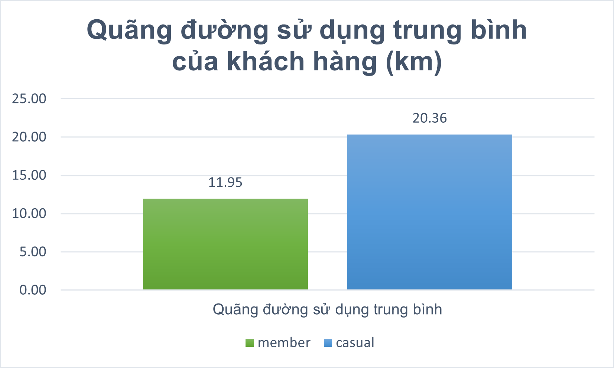
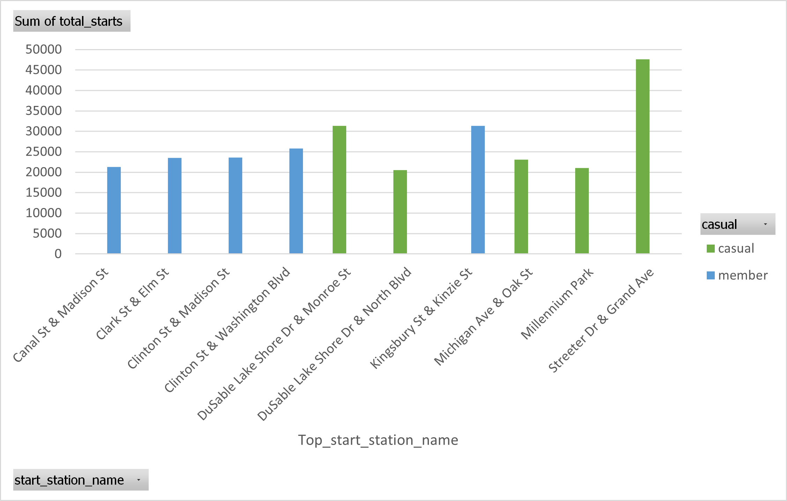

```{r echo=FALSE, out.width="20%", fig.align="center"}

```


### I. Giới thiệu dự án
Bộ dữ liệu được cung cấp bởi **Cyclistic** – một chương trình cho thuê xe đạp tại Chicago.

**Nguồn dữ liệu:** [Divvy Trip Data](https://divvy-tripdata.s3.amazonaws.com/index.html)  
**Số tháng phân tích:** 12 (07/2024 - 06/2025) 

Dữ liệu bao gồm thông tin chi tiết về từng chuyến đi như "thời lượng chuyến đi"," điểm bắt đầu – kết thúc", "loại xe sử dụng", và "loại người dùng" (người dùng thông thường – casual và thành viên đăng ký dài hạn – member).

Khoảng thời gian phân tích là 12 tháng từ 07/2024 đến 06/2025, với tổng cộng hơn 5,5 triệu chuyến đi sau khi làm sạch.

Mục tiêu của phân tích này là khám phá hành vi sử dụng dịch vụ, sự khác biệt giữa nhóm casual và member, và đề xuất các chiến lược marketing nhằm chuyển đổi người dùng casual thành member.

Trong dự án này, SQL được sử dụng để xử lý và làm sạch dữ liệu, trong khi Exel và R được dùng để trực quan hóa và phân tích chuyên sâu.

##### Câu hỏi phân tích chính
- Xu hướng sử dụng dịch vụ trong 12 tháng qua như thế nào?

- Casual và Member khác nhau ra sao trong cách sử dụng dịch vụ?

- Làm thế nào để khuyến khích casual trở thành member?

##### Quy trình xử lý dữ liệu
- Trước khi phân tích, dữ liệu được làm sạch trong SQL với các bước chính:

- Loại bỏ các chuyến đi thiếu thời gian bắt đầu/kết thúc hoặc tọa độ không hợp lệ.

- Loại bỏ các chuyến có thời lượng ≤ 0 phút hoặc > 1440 phút (trên 1 ngày).

 Thêm các cột tính toán:

- ride_length (phút) — chênh lệch giữa ended_at và started_at.

- day_of_week — ngày trong tuần của thời gian bắt đầu chuyến đi.

- Gộp dữ liệu từ 12 file CSV thành một bảng duy nhất để phân tích.

- Dữ liệu sau khi làm sạch sẵn sàng cho việc khai thác thông tin và trực quan hóa.

```{r setup, include=FALSE}
knitr::opts_chunk$set(echo = TRUE, message = FALSE, warning = FALSE)
library(knitr)
library(kableExtra)
library(ggplot2)
library(dplyr)
library(tidyr)
```
### II. Quy trình xử lý & làm sạch dữ liệu

#### 2.1 Import dữ liệu
- Dữ liệu thô gồm 12 file `.csv` từ **07/2024 → 06/2025**.
- Mỗi file chứa thông tin: `ride_id`, `rideable_type`, `started_at`, `ended_at`, `start_station_name`, `end_station_name`, tọa độ, và loại người dùng `member_casual`.
- Import từng file vào SQL Server Management Studio (SSMS) và đặt tên bảng dạng `divvy_tripdata_YYYYMM`.

```sql
-- 10 dòng đầu tiên
SELECT TOP 10 * FROM divvy_tripdata_202407;
```

#### 2.2 Gộp dữ liệu
   - Gộp dữ liệu của 12 tháng thành 1 bộ dữ liệu duy nhất 
```sql
SELECT *
INTO raw_trips_all
FROM divvy_tripdata_202407

INSERT INTO raw_trips_all
SELECT * FROM divvy_tripdata_202408
UNION ALL
SELECT * FROM divvy_tripdata_202409
...
SELECT * FROM divvy_tripdata_202507
```
#### 2.3 Tạo cột mới phục vụ phân tích
- Tạo cột ride_length để tính thời gian chuyến đi.
- Tạo cột day_of_week để biết chuyến đi diễn ra vào thứ mấy.
```sql
ALTER TABLE raw_trips_all
ADD ride_length AS DATEDIFF(MINUTE, started_at, ended_at);

ALTER TABLE raw_trips_all
ADD day_of_week AS DATENAME(WEEKDAY, started_at);
```
#### 2.4 Loại bỏ dữ liệu sai lệch
```sql
SELECT *
INTO clean_trips
FROM raw_trips_all
WHERE ride_length > 0
  AND ride_length <= 1440
  AND start_lat IS NOT NULL
  AND end_lat IS NOT NULL;
``` 
- Chuyến có thời gian ≤ 0 phút hoặc > 1440 phút (1 ngày) → loại.
- Bỏ chuyến thiếu tọa độ (start_lat, end_lat NULL).
- Loại bỏ ride_id trùng (nếu có).

#### 2.5 Kết quả làm sạch

- Tổng số chuyến trước khi làm sạch: <5,597,030>

- Tổng số chuyến mất đi  sau khi làm sạch: <~90,000>

- Phần trăm dữ liệu bị loại bỏ:<1,6%> không đáng ngại 

### III. Phân tích dữ liệu
#### 3.1 Số lượng chuyến theo loại người dùng
```sql
SELECT member_casual, COUNT(*) AS total_trips
FROM clean_trips
GROUP BY member_casual;
```
Kết quả 
Member: 3504237

Casual: 2008387

```{r echo=FALSE, out.width="60%", fig.align="center"}

```

Nhận xét:
Người dung member đi nhiều hơn ~1.7 lần so với người dùng casual
Nhóm member thực hiện nhiều chuyến hơn nhóm casual.
Điều này phản ánh tần suất sử dụng cao của người đăng ký dài hạn.

#### 3.2 Thời lượng trung bình mỗi chuyến
```sql
SELECT member_casual, AVG(CAST(ride_length AS FLOAT)) AS avg_ride_length
FROM clean_trips
GROUP BY member_casual;
```
Member: 11,95 phút

Casual: 20,36 phút

```{r echo=FALSE, out.width="60%", fig.align="center"}

```

Nhận xét:
Nhóm member thực hiện nhiều chuyến hơn nhóm casual.
Điều này phản ánh tần suất sử dụng cao của người đăng ký dài hạn.

#### 3.3 Sử dụng theo ngày trong tuần
```sql
SELECT day_of_week, 
       member_casual, 
       COUNT(*) AS total_rides
FROM clean_trips
GROUP BY day_of_week, member_casual
ORDER BY CASE day_of_week
           WHEN 'Monday'    THEN 1
           WHEN 'Tuesday'   THEN 2
           WHEN 'Wednesday' THEN 3
           WHEN 'Thursday'  THEN 4
           WHEN 'Friday'    THEN 5
           WHEN 'Saturday'  THEN 6
           WHEN 'Sunday'    THEN 7
         END;
```
```{r echo=FALSE, out.width="60%", fig.align="center"}

```

Nhận xét:

Member: Sử dụng ổn định từ thứ 2 → thứ 6 (đi làm, công việc).

Casual: Tăng mạnh vào thứ 7 & CN (du lịch, giải trí).

#### 3.4 Loại xe được sử dụng
```sql
SELECT rideable_type, member_casual, COUNT(*) AS usage_count
FROM clean_trips
GROUP BY rideable_type, member_casual;
```
Dưới đây là các loại xe được ưa chuộng bởi người dùng 

```{r echo=FALSE, out.width="60%", fig.align="center"}
knitr::include_graphics("Imgs/Rideable_type_member_casual.png")
```

Nhận xét:

Member có tần suất sử dụng cao hơn ở cả Classic Bike (1.485.483) và Electric Bike (1.961.492), cho thấy xu hướng sử dụng thường xuyên và đa dạng phương tiện.

Casual có tỷ lệ sử dụng Classic Bike (837.786) và Electric Bike (1.087.497) thấp hơn đáng kể, nhưng lại chiếm ưu thế ở Electric Scooter (83.104 so với 57.262), phản ánh nhu cầu trải nghiệm và tính linh hoạt cao hơn.

#### 3.5 Top 10 trạm bắt đầu phổ biến

Dưới đây là danh sách 10 trạm bắt đầu có số lượt sử dụng cao nhất, chia theo hai nhóm **Casual** và **Member**:

```{r echo=FALSE, out.width="60%", fig.align="center"}

```

Nhận xét:

Casual hay xuất phát từ trạm gần điểm du lịch.

Member thường bắt đầu ở các trạm gần trung tâm và khu văn phòng.

### IV. Kết luận & Đề xuất

#### 4.1 Kết luận chính
- **Member** chiếm đa số lượt đi (3,504,237 vs 2,008,387). Nhóm này sử dụng đều trong tuần và có thời lượng chuyến ngắn hơn (~11.9 phút), cho thấy họ dùng nhiều cho mục đích di chuyển/commute.
- **Casual** có thời lượng trung bình lớn hơn (~20.3 phút) và tăng mạnh vào **cuối tuần**; họ thường bắt đầu từ các trạm gần khu du lịch (Streeter Dr & Grand Ave, Millennium Park).  
- **Electric bike** là loại xe phổ biến nhất tổng thể; casual tương đối ưa chuộng xe điện/scooter hơn so với member.

#### 4.2 Đề xuất ưu tiên (Top 3)
1. **Chạy chiến dịch “Dùng thử Member – Cuối tuần”** hướng vào casual tại các trạm du lịch:  
   - Cung cấp voucher giảm giá membership cho người dùng casual từng sử dụng ≥ 2 lượt cuối tuần.  
   - KPI: tỉ lệ chuyển đổi casual → member tăng 3–5% trong 3 tháng thử nghiệm.

2. **Tối ưu phân bổ xe theo khu vực & thời điểm**:  
   - Tăng tần suất cung cấp electric_bike + scooter vào các trạm du lịch vào thứ 6–CN; đảm bảo đủ xe tại giờ cao điểm cho member (sáng/tối các ngày làm việc).  
   - KPI: giảm tỷ lệ thất thoát chuyến do “no bike” < 5% tại các trạm target; tăng lượt thuê trên mỗi xe (utilization).

3. **Chạy quảng cáo địa phương & A/B test ưu đãi**:  
   - Quảng cáo trên mạng xã hội / OOH mini quanh các trạm casual: thử 2 thông điệp (giảm phí đầu năm vs trải nghiệm unlimited weekend) để xem thông điệp nào chuyển đổi tốt hơn.  
   - KPI: CTR quảng cáo, số lượt đăng ký membership từ các mã khuyến mãi theo trạm.

#### 4.3 Kế hoạch hành động ngắn hạn (30–90 ngày)
- Tuần 1–2: Triển khai phân tích cohort & chọn 10 trạm target (dựa trên top stations).  
- Tuần 3–4: Thiết kế chương trình ưu đãi + landing page + creative cho quảng cáo.  
- Tháng 2–3: A/B test chương trình tại 5 trạm; đo lường chuyển đổi, giữ dữ liệu theo trạm.  
- Tháng 4: Mở rộng nếu hiệu quả; tối ưu tiếp dựa trên KPI.

#### 4.4 Gợi ý dữ liệu bổ sung để tối ưu hơn
- Thông tin vị trí cư trú (nếu có & hợp pháp) để cá nhân hoá ưu đãi.  
- Dữ liệu hành vi web/email để đo lường attribution (ai thấy ad → đăng ký).  
- Dữ liệu thời tiết để điều chỉnh dự đoán nhu cầu (mưa → nhu cầu giảm).